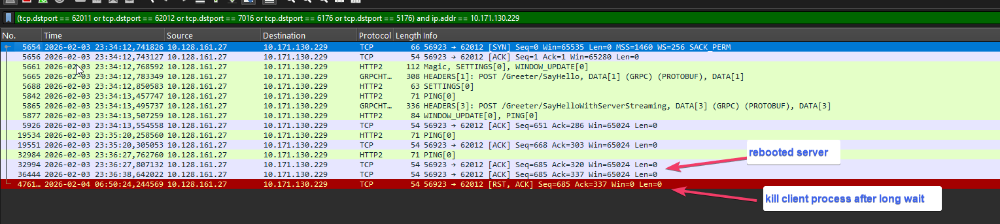

### What version of gRPC and what language are you using?

Language: C#

Client packages:

- Google.Protobuf: 3.33.5
- Grpc.Net.Client: 2.76.0
- Grpc.Tools: 2.76.0

Server package:

- Grpc.AspNetCore: 2.76.0

### What operating system (Linux, Windows,...) and version?

Windows.
 - Client is Windows 11
 - Server is Windows Server 2022

### What runtime / compiler are you using (e.g. .NET Core SDK version `dotnet --info`)

In production we are using .Net 8 and have the issue but I reproduced it with this sample in .Net 10 with the latest version of all packages as well

```
Host:
  Version:      10.0.0
  Architecture: x64
  Commit:       b0f34d51fc

.NET SDKs installed:
  2.1.202 [C:\Program Files\dotnet\sdk]
  2.1.526 [C:\Program Files\dotnet\sdk]
  2.1.602 [C:\Program Files\dotnet\sdk]
  5.0.207 [C:\Program Files\dotnet\sdk]
  5.0.416 [C:\Program Files\dotnet\sdk]
  6.0.410 [C:\Program Files\dotnet\sdk]
  8.0.303 [C:\Program Files\dotnet\sdk]
  8.0.411 [C:\Program Files\dotnet\sdk]
  9.0.304 [C:\Program Files\dotnet\sdk]
  10.0.100 [C:\Program Files\dotnet\sdk]

.NET runtimes installed:
  Microsoft.AspNetCore.All 2.1.9 [C:\Program Files\dotnet\shared\Microsoft.AspNetCore.All]
  Microsoft.AspNetCore.All 2.1.13 [C:\Program Files\dotnet\shared\Microsoft.AspNetCore.All]
  Microsoft.AspNetCore.All 2.1.30 [C:\Program Files\dotnet\shared\Microsoft.AspNetCore.All]
  Microsoft.AspNetCore.App 2.1.9 [C:\Program Files\dotnet\shared\Microsoft.AspNetCore.App]
  Microsoft.AspNetCore.App 2.1.13 [C:\Program Files\dotnet\shared\Microsoft.AspNetCore.App]
  Microsoft.AspNetCore.App 2.1.30 [C:\Program Files\dotnet\shared\Microsoft.AspNetCore.App]
  Microsoft.AspNetCore.App 3.1.32 [C:\Program Files\dotnet\shared\Microsoft.AspNetCore.App]
  Microsoft.AspNetCore.App 5.0.10 [C:\Program Files\dotnet\shared\Microsoft.AspNetCore.App]
  Microsoft.AspNetCore.App 5.0.17 [C:\Program Files\dotnet\shared\Microsoft.AspNetCore.App]
  Microsoft.AspNetCore.App 6.0.18 [C:\Program Files\dotnet\shared\Microsoft.AspNetCore.App]
  Microsoft.AspNetCore.App 6.0.36 [C:\Program Files\dotnet\shared\Microsoft.AspNetCore.App]
  Microsoft.AspNetCore.App 7.0.20 [C:\Program Files\dotnet\shared\Microsoft.AspNetCore.App]
  Microsoft.AspNetCore.App 8.0.7 [C:\Program Files\dotnet\shared\Microsoft.AspNetCore.App]
  Microsoft.AspNetCore.App 8.0.17 [C:\Program Files\dotnet\shared\Microsoft.AspNetCore.App]
  Microsoft.AspNetCore.App 8.0.19 [C:\Program Files\dotnet\shared\Microsoft.AspNetCore.App]
  Microsoft.AspNetCore.App 8.0.22 [C:\Program Files\dotnet\shared\Microsoft.AspNetCore.App]
  Microsoft.AspNetCore.App 9.0.8 [C:\Program Files\dotnet\shared\Microsoft.AspNetCore.App]
  Microsoft.AspNetCore.App 9.0.11 [C:\Program Files\dotnet\shared\Microsoft.AspNetCore.App]
  Microsoft.AspNetCore.App 10.0.0 [C:\Program Files\dotnet\shared\Microsoft.AspNetCore.App]
  Microsoft.NETCore.App 2.0.9 [C:\Program Files\dotnet\shared\Microsoft.NETCore.App]
  Microsoft.NETCore.App 2.1.9 [C:\Program Files\dotnet\shared\Microsoft.NETCore.App]
  Microsoft.NETCore.App 2.1.13 [C:\Program Files\dotnet\shared\Microsoft.NETCore.App]
  Microsoft.NETCore.App 2.1.30 [C:\Program Files\dotnet\shared\Microsoft.NETCore.App]
  Microsoft.NETCore.App 3.1.32 [C:\Program Files\dotnet\shared\Microsoft.NETCore.App]
  Microsoft.NETCore.App 5.0.10 [C:\Program Files\dotnet\shared\Microsoft.NETCore.App]
  Microsoft.NETCore.App 5.0.17 [C:\Program Files\dotnet\shared\Microsoft.NETCore.App]
  Microsoft.NETCore.App 6.0.18 [C:\Program Files\dotnet\shared\Microsoft.NETCore.App]
  Microsoft.NETCore.App 6.0.28 [C:\Program Files\dotnet\shared\Microsoft.NETCore.App]
  Microsoft.NETCore.App 6.0.36 [C:\Program Files\dotnet\shared\Microsoft.NETCore.App]
  Microsoft.NETCore.App 7.0.20 [C:\Program Files\dotnet\shared\Microsoft.NETCore.App]
  Microsoft.NETCore.App 8.0.7 [C:\Program Files\dotnet\shared\Microsoft.NETCore.App]
  Microsoft.NETCore.App 8.0.17 [C:\Program Files\dotnet\shared\Microsoft.NETCore.App]
  Microsoft.NETCore.App 8.0.19 [C:\Program Files\dotnet\shared\Microsoft.NETCore.App]
  Microsoft.NETCore.App 8.0.22 [C:\Program Files\dotnet\shared\Microsoft.NETCore.App]
  Microsoft.NETCore.App 9.0.8 [C:\Program Files\dotnet\shared\Microsoft.NETCore.App]
  Microsoft.NETCore.App 9.0.11 [C:\Program Files\dotnet\shared\Microsoft.NETCore.App]
  Microsoft.NETCore.App 10.0.0 [C:\Program Files\dotnet\shared\Microsoft.NETCore.App]
  Microsoft.WindowsDesktop.App 3.1.32 [C:\Program Files\dotnet\shared\Microsoft.WindowsDesktop.App]
  Microsoft.WindowsDesktop.App 5.0.10 [C:\Program Files\dotnet\shared\Microsoft.WindowsDesktop.App]
  Microsoft.WindowsDesktop.App 5.0.17 [C:\Program Files\dotnet\shared\Microsoft.WindowsDesktop.App]
  Microsoft.WindowsDesktop.App 6.0.18 [C:\Program Files\dotnet\shared\Microsoft.WindowsDesktop.App]
  Microsoft.WindowsDesktop.App 6.0.28 [C:\Program Files\dotnet\shared\Microsoft.WindowsDesktop.App]
  Microsoft.WindowsDesktop.App 6.0.36 [C:\Program Files\dotnet\shared\Microsoft.WindowsDesktop.App]
  Microsoft.WindowsDesktop.App 7.0.20 [C:\Program Files\dotnet\shared\Microsoft.WindowsDesktop.App]
  Microsoft.WindowsDesktop.App 8.0.7 [C:\Program Files\dotnet\shared\Microsoft.WindowsDesktop.App]
  Microsoft.WindowsDesktop.App 8.0.17 [C:\Program Files\dotnet\shared\Microsoft.WindowsDesktop.App]
  Microsoft.WindowsDesktop.App 8.0.19 [C:\Program Files\dotnet\shared\Microsoft.WindowsDesktop.App]
  Microsoft.WindowsDesktop.App 8.0.22 [C:\Program Files\dotnet\shared\Microsoft.WindowsDesktop.App]
  Microsoft.WindowsDesktop.App 9.0.8 [C:\Program Files\dotnet\shared\Microsoft.WindowsDesktop.App]
  Microsoft.WindowsDesktop.App 9.0.11 [C:\Program Files\dotnet\shared\Microsoft.WindowsDesktop.App]
  Microsoft.WindowsDesktop.App 10.0.0 [C:\Program Files\dotnet\shared\Microsoft.WindowsDesktop.App]

Other architectures found:
  arm64 [C:\Program Files\dotnet]
    registered at [HKLM\SOFTWARE\dotnet\Setup\InstalledVersions\arm64\InstallLocation]
  x86   [C:\Program Files (x86)\dotnet]
    registered at [HKLM\SOFTWARE\dotnet\Setup\InstalledVersions\x86\InstallLocation]

Environment variables:
  Not set

global.json file:
  Not found

Learn more:
  https://aka.ms/dotnet/info

Download .NET:
  https://aka.ms/dotnet/download

```

### What did you do?

We have a long lived streaming call between a client application and a grpc server hosted in a windows service on a windows server machine. In our application where we initially witnessed the problem, it is a `AsyncDuplexStreamingCall` call. But I also reproduced it with this sample where I modified the Greeter sample to use an `AsyncServerStreamingCall`.

The client channel is configured to use tcp keepalive. When the server reboots, I would expect the client streaming call to be cancelled eventually when the tcp keepalive detects that the server is not responding, but the client streaming call (`ResponseStream.MoveNext()`) never ends.

The client tcp keepalive is configured this way in the client application

```csharp
var handler = new SocketsHttpHandler
{
    KeepAlivePingDelay = TimeSpan.FromSeconds(60),
    KeepAlivePingTimeout = TimeSpan.FromSeconds(30),
    KeepAlivePingPolicy = HttpKeepAlivePingPolicy.WithActiveRequests,
};
using var channel = GrpcChannel.ForAddress(SERVER_ADDRESS, new GrpcChannelOptions { HttpHandler = handler });
```

Then I do the following to do the long streaming call. All of this is in a try/catch. I would expect an exception to be thrown or the server stream to complete when the server is reboot.

```csharp
using (AsyncServerStreamingCall<HelloReply> serverStreaming = client.SayHelloWithServerStreaming(new HelloRequest() { Name = "GreeterClientStreaming" }))
{
    while (await serverStreaming.ResponseStream.MoveNext())
    {
        HelloReply streamReply = serverStreaming.ResponseStream.Current;
        Console.WriteLine("Stream Reply: " + streamReply.Message);
    }
    Console.WriteLine("Server stream terminated");
}
```

I reboot the server with the following PowerShell command:

```powershell
Invoke-Command -ComputerName <name_of_my_server> -ScriptBlock {shutdown /r /t 2}
```

Is it ok to assume that tcp keepalive would cancel pending streaming calls when it detects that the server is no longer responding ? Note that rebooting the server seems to be the only way to reproduce the behavior. if I kill the service process, the client streaming call is immediately cancelled. I can reproduce the problem with the code in this sample (Greeter sample modified to do a streaming call)

### What did you expect to see?

I would expect the call `await serverStreaming.ResponseStream.MoveNext()` to throw an exception when the server reboots, or at least return to inform that the server finished writing to the stream. This is what happened with `Grpc.Core` when our client application was in .NET Framework.


### What did you see instead?

The client waits forever as it can be seen in the following Wireshark screenshot. We see the first few pings at 60-second intervals. When I reboot the server, I see an ACK packet (not at the regular 1-minute interval but when the server reboots) but the client wait continues forever until I finally kill the client application (after a wait of many hours in the provided Wireshark capture).



### Anything else we should know about your project / environment?

In our real application, we actually have a `AsyncDuplexStreamingCall` and are using Client load balancing with 2 servers. We have a retry mechanism when the streaming call fails or terminates unexpectedly so we can restart the streaming call and it gets handled by the other server, allowing us to reboot a server without issues. This used to work when the client was in .NET Framework using `Grpc.Core` and we are trying to achieve the same logic with `Grpc.Net.Client`.

I tested with `AsyncDuplexStreamingCall` and having the client periodically write a small message to the request stream (let's say every minute). With that in place I can detect that the connection is lost when writing to the request stream. But I want to check first that I am indeed supposed to do this on my end.
